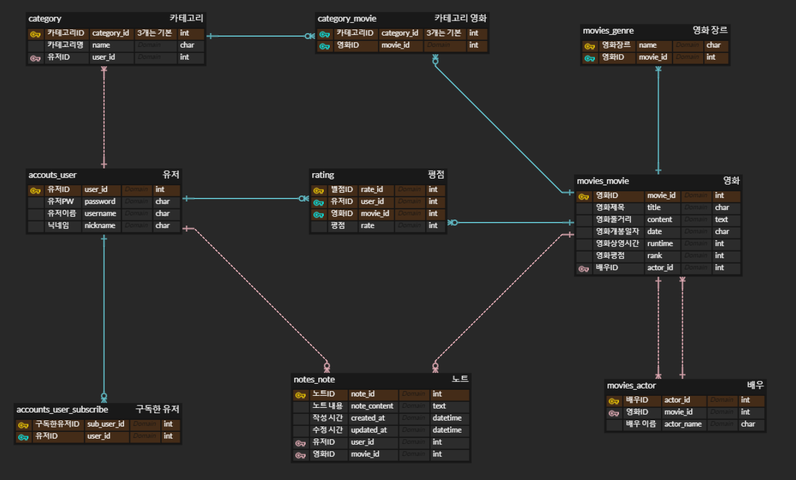

# 영화 추천 프로젝트

# MOVIE.zip

영화 리뷰의 알집

### 🗓️ 프로젝트 진행 기간 : 2024.05.16 ~ 2024.05.23

## 팀원 정보 및 업무 분담 내역

정훈 - 영화 검색 및 데이터 베이스 저장 / 영화 추천 알고리즘 / 사이트 구현

차민주 - ERD설계 / 게시글 작성 CRUD / 팔로잉, 팔로우 기능 구현 / 개인별 카테고리 관리 기능 구현

## 목표 서비스 구현 및 실제 구현 정도

## 데이터 베이스 모델링



## 영화 추천 알고리즘에 대한 기술적 설명

장르 백터화

```python
vectorizer = CountVectorizer()
genre_matrix = vectorizer.fit_transform(pd.concat([df['genres'], pd.Series([selected_genres_str])]))
```

- `CountVectorizer`는 텍스트 데이터를 벡터화하는 데 사용됩니다. 영화 장르 데이터를 벡터화하여 각 장르를 수치화된 형태로 변환합니다.
- `df['genres']`는 모든 영화의 장르 데이터를 포함하고 있습니다.
- `pd.Series([selected_genres_str])`는 사용자가 선택한 영화들의 고유한 장르 문자열입니다.
- 이 두 데이터를 `pd.concat`을 사용하여 연결한 후 벡터화합니다. 이를 통해 영화 장르 데이터를 벡터 공간에 매핑합니다.

---

코사인 유사도 계산

```python
cosine_sim = cosine_similarity(genre_matrix[-1], genre_matrix[:-1])
```

- `cosine_similarity`는 두 벡터 간의 코사인 유사도를 계산하는 함수입니다.
- `genre_matrix[-1]`는 사용자가 선택한 장르의 벡터입니다.
- `genre_matrix[:-1]`는 데이터프레임에 있는 모든 영화의 장르 벡터입니다.
- 이를 통해 사용자 선택 장르와 다른 영화 장르 간의 유사도를 계산합니다.
- 유사도가 높을수록 두 영화의 장르가 유사하다는 것을 의미합니다.

---

영화 추천

```python
recommended_movie_indices = cosine_sim.argsort()[0][-N:][::-1]
recommended_movies = df.iloc[recommended_movie_indices]
```

- `cosine_sim.argsort()[0]`는 유사도 점수를 정렬하여 인덱스를 반환합니다.
- `[-N:]`는 상위 N개의 영화를 선택하는 것을 의미합니다.
- `[::-1]`는 유사도가 높은 순서대로 정렬하기 위해 인덱스를 뒤집습니다.
- `df.iloc[recommended_movie_indices]`는 추천된 영화들의 정보를 포함하는 데이터프레임을 생성합니다.

## 핵심 기능에 대한 설명

1. 영화 추천 알고리즘

- 사용자가 직접 선택한 영화 다섯개를 장르와 비교해 추천하는 알고리즘

2. 영화 검색

- API를 통해 영화를 검색하고 해당 영화의 상세정보가 데이터 베이스에 있으면 그대로 불러오고 없으면 데이터 베이스에 저장후 출력

3. 카테고리

- 사용자가 직접 카테고리를 추가, 삭제 할 수 있는 기능
- 생성한 카테고리에 영화를 추가, 삭제 할 수 있는 기능

4. 사용자들 간의 커뮤니케이션

- 사용자들 사이에 영화 리뷰를 공유 할 수 있는 게시판 기능
- 구독 기능 구현을 통해 메인 화면 구독한 유저의 리뷰를 최신순으로 조회하는 기능

5. 기본적인 기능

- 회원가입, 로그인, 로그아웃 기능

## 느낀 점 후기


- 정훈 

Django와 Vue를 이용한 영화 추천 시스템 프로젝트는 데이터베이스 설계부터 데이터 수집, 데이터 가공, 그리고 최종적으로 사용자에게 적합한 영화를 추천하는 전 과정을 직접 구현해본 첫 프로젝트였습니다. 이 프로젝트를 처음부터 끝까지 진행하면서 많은 어려움과 도전 과제가 있었지만, 동시에 매우 값진 경험을 얻을 수 있었습니다.

프로젝트의 시작은 데이터베이스 설계였습니다. ERD(엔터티 관계 다이어그램) 설계를 통해 데이터베이스의 구조를 시각적으로 표현하고 데이터 간의 관계를 명확하게 정의할 수 있었습니다. Django의 ORM(Object-Relational Mapping)을 사용하여 데이터베이스 모델을 설계하고 구현하는 과정에서 데이터베이스 설계의 중요성을 깊이 깨닫게 되었습니다.

다음 단계는 데이터 수집이었습니다. 영화 추천 시스템에 필요한 데이터는 매우 다양하고 방대했습니다. 여러 소스에서 데이터를 수집하고 이를 정제하는 과정은 많은 시간과 노력이 필요했습니다. 웹 스크래핑과 다양한 API 호출을 통해 데이터를 수집하고, 수집한 데이터를 정제하여 신뢰성과 정확성을 유지하는 것이 중요했습니다. 이 과정에서 데이터 수집 및 정제 기술을 익히는 좋은 기회가 되었습니다.

데이터를 수집한 후에는 이를 가공하는 작업이 있었습니다. 수집된 데이터를 분석에 적합한 형태로 변환하는 과정에서 데이터 전처리의 중요성을 실감할 수 있었습니다. 중복 데이터를 제거하고, 결측치를 처리하며, 데이터를 변환하여 보다 정교하고 신뢰성 있는 데이터를 만들기 위해 많은 노력을 기울였습니다.

프론트엔드는 Vue.js를 사용하여 사용자 인터페이스를 개발했습니다. 사용자 경험을 최적화하기 위해 Vue의 다양한 기능과 컴포넌트를 활용하여 직관적이고 반응형인 UI를 구현했습니다. 사용자에게 영화를 추천하는 화면을 설계하고, 사용자 입력을 받아 백엔드와 상호작용하는 과정을 통해 Vue.js의 강력한 기능을 체험할 수 있었습니다.

백엔드는 Django를 기반으로 하여 추천 시스템을 구현했습니다. 다양한 추천 알고리즘을 적용하여 사용자에게 맞춤형 영화를 추천하는 기능을 개발했습니다. 협업 필터링, 콘텐츠 기반 필터링, 그리고 하이브리드 필터링을 사용하여 보다 정교한 추천을 제공할 수 있도록 노력했습니다. Django의 강력한 기능을 활용하여 백엔드 로직을 구현하고, RESTful API를 통해 프론트엔드와의 통신을 원활하게 처리했습니다.

전체적으로, 이 프로젝트는 Django와 Vue.js를 활용하여 영화 추천 시스템을 개발하는 전 과정을 경험할 수 있는 값진 기회였습니다. 처음에는 많은 어려움이 있었지만, 이를 극복하면서 얻은 지식과 경험은 앞으로의 프로젝트에 큰 자산이 될 것입니다. 이 프로젝트를 통해 배운 것들을 바탕으로, 앞으로 더 나은 시스템을 개발하고 보다 정교한 데이터를 다룰 수 있는 능력을 갖추게 되었습니다.
- 차민주

프로젝트를 통해 DB 설계와 웹 서비스 개발 과정에서 프론트엔드와 백엔드의 상호작용에 대해 깊은 이해를 할 수 있는 기회를 가졌습니다. ERD 설계 초기 단계에서는, 데이터 간의 관계를 명확하게 이해하고 효율적으로 데이터를 관리할 수 있는 구조를 구상하는 것이 쉽지 않았습니다. 하지만 여러 시행착오를 겪으며, 각 데이터 모델의 연관 관계를 더욱 명확하게 파악할 수 있었고, 이를 통해 데이터베이스의 성능을 최적화하는 방법을 배울 수 있었습니다.

또한 CRUD와 구독 기능, 그리고 개인별 카테고리 관리 기능을 구현하면서, Django 프레임워크의 다양한 기능과 웹 애플리케이션 개발의 전반적인 흐름을 이해할 수 있었습니다. 특히, 사용자 경험을 향상시키기 위해 노력한 부분들이 많았는데, 이 과정에서 프론트엔드와 백엔드가 서로 어떻게 통신하는지, 그리고 사용자의 편의성을 위해 어떤 기능들이 필요한지에 대해 깊이 고민해볼 수 있었습니다.

팀 프로젝트를 진행하며 협업의 중요성을 다시 한번 깨달았습니다. 각자 맡은 부분이 있었지만, 프로젝트의 전체적인 흐름을 이해하고 서로의 작업에 대해 피드백을 주고받으며, 더 나은 결과물을 만들기 위해 노력했습니다. 이 과정에서 의사소통의 중요성과 함께, 다른 사람의 의견을 경청하고, 적극적으로 소통하는 태도가 얼마나 중요한지를 배웠습니다.

이 프로젝트를 진행하며 얻은 경험과 지식은 제 개발 역량을 한 단계 더 성장시키는 데 큰 도움이 되었습니다. 앞으로 이 경험을 바탕으로 더 많은 프로젝트에 참여하며, 제가 배운 지식을 실제로 적용하고, 더 많은 것을 배워나가고 싶습니다. 비록 도전적이고 어려운 순간들도 있었지만, 이를 극복하며 느낀 성취감과 함께 팀원들과의 협업을 통해 얻은 귀중한 경험들은 저에게 큰 자산이 될 것입니다. 
